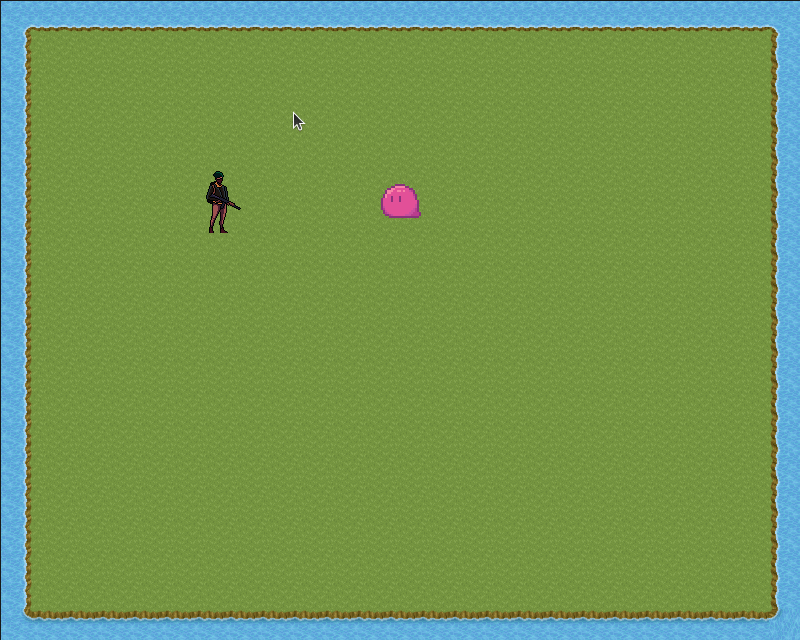

# Criando mini game com Template TypeScript do Phaser 3

| Command | Description |
|---------|-------------|
| `npm install` | Install project dependencies |
| `npm run watch` | Build project and open web server running project, watching for changes |
| `npm run dev` | Builds project and open web server, but do not watch for changes |
| `npm run build` | Builds code bundle with production settings (minification, no source maps, etc..) |

## Tutorial
 Criei esse projeto para aprender a usar Phaser 3 na criação de jogos.

 Canal do Youtube: [Programando Juntos](https://www.youtube.com/watch?v=xmVvY3S5bC4&list=PLA_KBeWRlh0RJOs8DMtg8bKA_Pw_nk-MF&ab_channel=ProgramandoJuntos)

 [Repositorio do projeto](https://github.com/LeandroVCastro/rpg-phaser)

  1) Criando mapa RPG com Tiled Editor para Phaser JS
  2) Criando um RPG do zero
  3) Criando Personagem
  4) Movimentação do personagem e ataque 
  5) Colisão e limitando ataques
  6) Atirando e Criando inimigo 
  7) Continua ...

### Game

## Versions Used

* Phaser 3.60
* TypeScript 5.0.3
* Rollup 3.20.2
* Rollup Plugins:
  * @rollup/plugin-commonjs 24.0.1
  * @rollup/plugin-node-resolve 15.0.2
  * @rollup/plugin-replace 5.0.2
  * @rollup/plugin-terser 0.4.0
  * @rollup/plugin-typescript 11.1.0
  * rollup-plugin-serve 2.0.2
